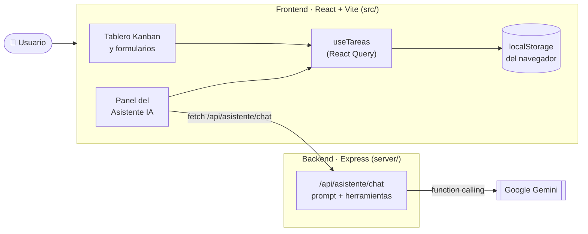
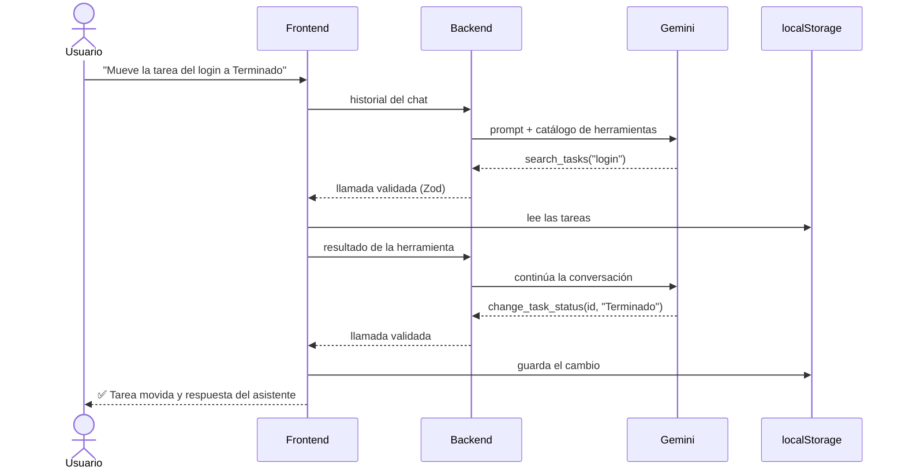

# 📋 Mi Kanban Board

Tablero Kanban para organizar tareas en tres columnas — **Por hacer → Haciendo → Terminado** — con un **Asistente IA** integrado que entiende lenguaje natural: puedes pedirle *"¿qué tengo vencido?"*, *"planifica mi día"* o *"crea tres tareas para preparar la demo"* y trabaja directamente sobre tus tareas reales.


---

## ✨ Funcionalidades

- **Tablero Kanban** con arrastrar y soltar (ratón y pantallas táctiles).
- **Sin base de datos:** las tareas se guardan en el navegador; no hay que configurar nada.
- **Tareas** con título, descripción, categoría, prioridad, estado y fecha de vencimiento.
- **Búsqueda** por texto y **filtro** por prioridad.
- **Avisos de vencimiento** en cada tarjeta (vencida, vence hoy, próxima).
- **Tema claro / oscuro**.
- **Asistente IA** (Google Gemini) que consulta, resume, crea y modifica tareas. Los cambios importantes piden **confirmación** antes de aplicarse.

---

## 🏗️ Arquitectura

Frontend y backend viven en el mismo repositorio y se despliegan juntos en Vercel bajo un único dominio. Las tareas se guardan en el navegador, así que **no hace falta base de datos**; el backend existe solo para mantener oculta la API key de Gemini.



| Capa | Ubicación | Responsabilidad |
|---|---|---|
| **Frontend** | `src/` | Interfaz, estado del tablero (React Query) y ejecución de las acciones del asistente. |
| **Almacenamiento** | `src/services/tareas-locales.ts` | Guarda las tareas en el `localStorage` del navegador. |
| **API del asistente** | `server/asistente/` | Guarda la API key, construye el prompt, define las herramientas y valida lo que pide el modelo. |
| **Entrada en Vercel** | `api/index.ts` | Expone la app de Express como función serverless. |
| **Modelo** | `src/types/tarea.ts` | Tipo `Tarea` y listas de estados, prioridades y categorías. |

### 🤖 Cómo funciona el Asistente IA

El modelo **nunca toca los datos directamente**. Solo puede *pedir* herramientas de un catálogo cerrado; el backend valida los argumentos y el frontend las ejecuta con las mismas funciones que usa el tablero.



| Herramienta | Modo | Qué hace |
|---|---|---|
| `get_tasks`, `get_task`, `search_tasks`, `get_task_summary` | lectura | Consultar y resumir tareas |
| `create_task`, `create_tasks`, `update_task`, `update_tasks` | confirmación | Crear o modificar (el usuario confirma) |
| `change_task_status` | directa | Mover una tarea de columna |
| `ask_user_to_select_task` | interacción | Elegir entre varias tareas parecidas |

---

## 📁 Estructura

```
my-kanban-board/
├── api/index.ts            # Función serverless de Vercel (reutiliza server/app.ts)
├── server/
│   ├── app.ts              # App de Express: ruta del asistente y errores
│   ├── dev.ts              # Servidor de desarrollo (puerto 3001)
│   └── asistente/          # Prompt, herramientas y conexión con Gemini
├── src/
│   ├── pages/              # Tablero, detalle de tarea, 404
│   ├── components/         # kanban/, asistente/ y ui/ (shadcn)
│   ├── asistente/          # Estado del chat y ejecutores de herramientas
│   ├── hooks/use-tareas.ts # Acceso a datos del tablero
│   ├── services/           # Guardado de tareas en el navegador
│   └── types/tarea.ts      # Modelo de la tarea
├── scripts/dev.mjs         # Arranca backend y frontend a la vez
└── vercel.json             # Build, función y rutas para Vercel
```

---

## 🚀 Ejecutar en local

**Requisitos:** Node.js 20.12 o superior.

```bash
git clone https://github.com/<tu-usuario>/my-kanban-board.git
cd my-kanban-board
npm install
cp .env.example .env      # completa GEMINI_API_KEY
npm run dev               # → http://localhost:5173
```

La primera vez que abres la app se cargan 8 tareas de ejemplo. Se guardan en tu navegador: cada navegador tiene su propio tablero, y si borras los datos del navegador se pierden.

| Script | Descripción |
|---|---|
| `npm run dev` | Backend y frontend a la vez |
| `npm run dev:api` / `npm run dev:web` | Cada parte por separado |
| `npm run build` | Comprueba tipos y genera `dist/` |
| `npm run lint` | Revisa el código con ESLint |

### Variables de entorno

| Variable | ¿Obligatoria? | Descripción |
|---|---|---|
| `GEMINI_API_KEY` | Para el asistente | Clave gratuita en [Google AI Studio](https://aistudio.google.com) |
| `GEMINI_MODEL` / `GEMINI_MODEL_RESPALDO` | No | Modelo principal y de respaldo |
| `PORT` | No | Puerto del backend en local (3001) |

> 🔒 La API key solo existe en el backend: nunca se envía al navegador. `.env` está excluido del repositorio.

---

## ☁️ Despliegue en Vercel

1. Importa el repositorio en [vercel.com/new](https://vercel.com/new). Vite y `vercel.json` se detectan solos.
2. En **Environment Variables** añade `GEMINI_API_KEY`.
3. Haz clic en **Deploy**. No hace falta crear ninguna base de datos.

Comprueba que el backend responde en `https://<tu-app>.vercel.app/api/salud`.

---

## 🔌 API REST

| Método | Ruta | Cuerpo | Respuesta |
|---|---|---|---|
| `POST` | `/api/asistente/chat` | Historial del chat | Respuesta del modelo y herramientas pedidas |
| `GET` | `/api/salud` | — | Estado del backend |

---

## 🛠️ Tecnologías

**Frontend:** React 19 · TypeScript · Vite · Tailwind CSS 4 · shadcn/ui · React Router · TanStack Query · Zustand · dnd-kit
**Backend:** Node.js · Express 5 · Zod
**IA:** Google Gemini (function calling)
**Infraestructura:** Vercel
